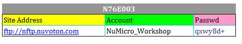

# [N76E003](https://github.com/mcuyun/N76E003) 

 

####  qitas@qitas.cn

#### 归属：[8051](https://github.com/sochub/MCS-51) 

## [描述](https://github.com/sochub/N76E003/wiki) 

N76E003是低成本高可靠性单片机的代表，价格秒杀同规格产品，单片机的各种外设齐全，包括UART/SPI/IIC和12bit ADC等

资源下载

 

主要特点：超高性价比的低成本方案

功能特点：接口全面

主要短板：8051内核和 20PIN

器件封装：

#### [docs](docs/)

参考设计和数据手册

#### [工程文件](project/)

包括软硬件设计资源

https://github.com/OpenNuvoton

#### [开发工具](tools/)

---

###  [SoC开发平台](http://www.qitas.cn)   
