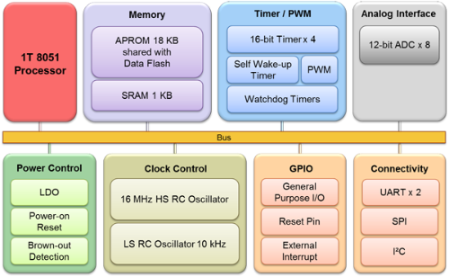
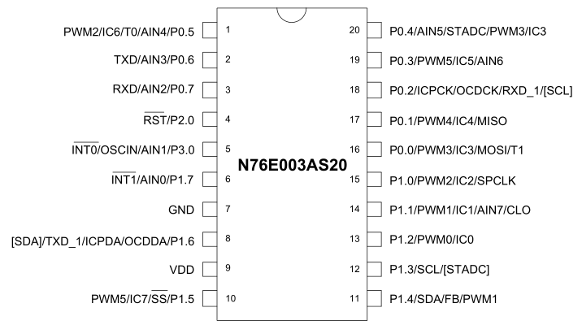
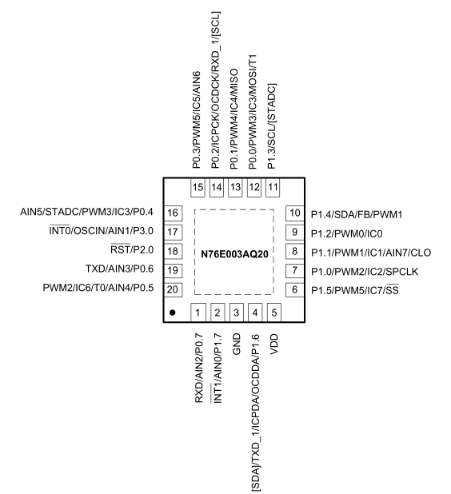
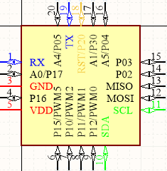

# [N76E003](https://github.com/sochub/N76E003)

#### 厂商：[nuvoton](https://github.com/sochub/nuvoton)

#### 架构：[8051](https://github.com/sochub/8051)

## [N76E003简介](https://github.com/sochub/N76E003/wiki)

N76E003是新唐高速1T 8051 单片机产品，18 KB Flash ROM、1 KB SRAM，支持2.4V - 5.5V宽工作电压，具备高抗干扰能力7KV ESD/4KV EFT。

N76E003 在20 pin封装下提供高达18根I/O脚位；周边包含双串口、SPI、I²C、6通道PWM输出；内建优于同类产品之 < 2% 误差之高精确度16 MHz RC晶振与高分辨率8通道12位ADC；

N76E003是低成本高可靠性单片机的代表，价格在同规格产品很有竞争力，各种外设齐全，具备自我唤醒欠压检测等功能。

关键特性：

* 超高性价比低成本MCU
* 接口全面，兼容性强

不足：只有20PIN的封装规格

### [资源组成](https://github.com/sochub/N76E003)

* [参考文档](docs/)
	* [芯片手册](docs/)
* [固件资源](firmware/)
	* [IAR开发工程](firmware/IAR)
	* [Keil开发工程](firmware/Keil)
	* [SDCC开发工程](firmware/SDCC)
* [硬件资源](hardware/)
	* [kicad资源](hardware/kicad/)
	* [AD资源](hardware/AD/)
* [ISP工程](ISP/)
	* [ISP Keil工程](ISP/keil)
	* [ISP 下载工具](ISP/tools)

资源说明：

本仓库正在整理过程中，涵盖的资源没有完善相应的体系，但是相应的资源已经可以使用

* [官方硬件资料](http://www.nuvoton.com.cn/hq/support/tool-and-software/development-tool-hardware/development-kit/?__locale=zh)
* [官方开源代码](https://github.com/OpenNuvoton/N76E003-BSP)

#### [硬件开发资源](https://github.com/sochub/N76E003)

* N76E003AS20 封装：TSSOP20 (4.4mm x 6.5mm)

TSSOP20封装兼容升级替换可选[STM32F030F4](https://github.com/sochub/STM32F030F4)

* N76E003AQ20 封装：QFN20 (3mm x 3mm, O.4mm pitch)
* N76E003BQ20 封装：QFN20 (3mm x 3mm, O.5mm pitch)

### [选型建议](https://github.com/sochub/N76E003)

* 高性价比替换方案[STM32F030](https://github.com/sochub/STM32F030)
* 硬件兼容替换方案[STM8S003](https://github.com/sochub/STM8S003)
* 软件兼容替换方案[C8051F330](https://github.com/sochub/C8051F330)

##  [SoC资源平台](http://www.qitas.cn)
