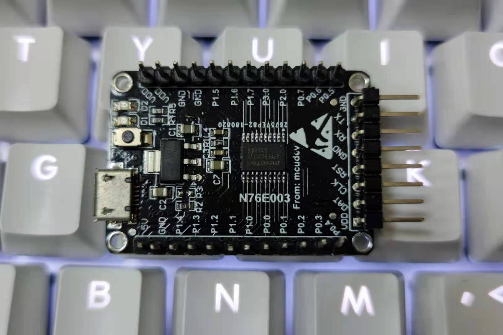

# [N76E003](https://github.com/SoCXin/N76E003)

* [nuvoton](http://www.nuvoton.com.cn/)：[8051](https://github.com/SoCXin/MCS51)
* [L1R1](https://github.com/SoCXin/Level)：16 MHz

## [Xin简介](http://www.SoC.Xin/N76E003)

[N76E003](http://www.nuvoton.com.cn/hq/products/microcontrollers/8bit-8051-mcus/low-pin-count-8051-series/n76e003/?__locale=zh) 是新唐高速1T 8051 单片机产品，18 KB Flash ROM、1 KB SRAM，在20pin封装下提供高达18根I/O脚位；周边包含双串口、SPI、I²C、6通道PWM输出；内建优于同类产品之 < 2% 误差之高精确度16 MHz RC晶振与高分辨率8通道12位ADC；备自我唤醒欠压检测等功能。

#### 关键特性

* 7KV ESD/4KV EFT
* 8ch*12bit ADC
* 2.4V 至 5.5V
* 40 ℃ 至 105 ℃
* 内置< 2 % 误差16 MHz 高精度RC晶振
* 内置低速省电10 kHz RC晶振

### [Xin资源收录](https://github.com/SoCXin)

* [参考资源](src/)
* [参考文档](docs/)
* [参考工程](project/)
* [入门教程](https://docs.soc.xin/N76E003.html)

### [Xin选型建议](https://github.com/SoCXin)

[N76E003](https://github.com/SoCXin/N76E003) 和 [STM8S003](https://github.com/SoCXin/STM8S003) 是市场上众多 003 系列小封装单片机的标杆，十分经典。

[相关工具](https://www.nuvoton.com/tool-and-software/ide-and-compiler/)

#### 封装规格

* 封装TSSOP20 (4.4mm x 6.5mm)

* N76E003AQ20 封装：QFN20 (3mm x 3mm, 0.4mm pitch)
* N76E003BQ20 封装：QFN20 (3mm x 3mm, 0.5mm pitch)

### 验证开发板

#### 高可用度开源项目

* [N76E003-BSP](https://github.com/OpenNuvoton/N76E003-BSP)
* [SDCC project](https://github.com/wkaster/N76E003)

### [探索芯世界 www.SoC.xin](http://www.SoC.Xin)
